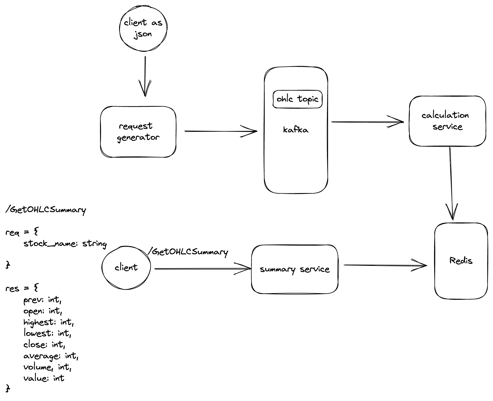

# Stockbit Test

## How It Works


- **Request-genator** : For simplicity in this project. Let's think the request-generator service as something that can handle a lot of transactions with tiny, speedy data. We'll be getting a lot of requests, then we'll send them on to the message broker.
- **Calculation Service** : Wow! 🤩 We've got an incredible calculator service that will make doing calculations so much simpler! This service using [vertical slice architechture](https://garywoodfine.com/implementing-vertical-slice-architecture/) for organanizing code to make it easier to maintain.
- **Summary Service** : Where clients can get instant results!


## Getting started

- local
  - run request-generator
    ```
    $ make run-rg
    ```
  - run calculation-service
    ```
    $ make run-cs
    ```
  - run summary-service
    ```
    $ make run-ss
    ```
  - run all app
    ```
    $ make run-all-app
    ```
- unit testing
  ```
  $ make test
  $ make test-coverage 
  ```
- generate protobuff
  ```
  $ make proto
  ```
- step by step run manualy
  - run kafka first
  ```
  $ make run-kafka
  ```
  - wait until kafka ready
  - run redis
  ```
  $ make run-redis
  ```
  - run app
  ```
   $ make run-cs
   $ make run-ss
   $ make run-rg
  ```
## Project Structure
  
### Calculation Service
A robust and versatile structure, perfect for large projects and capable of accommodating various business domains.

- [x] `main.go` : Application start from here
- [x] `package/`: Defines the _core domain_.
  - [x] `config/`: Please check this carefully before we launch :rocket: 
  - [x] `manager/`: This will prepare everything we need
  - [x] `kafka/`: You can connect to kafka
  - [x] `redis/`: You can connect to redis
- [x] `service/`: Place to manage all feature
  - [x] `[feature]`: What domain expert needs 
    - [ ] `handler/`: Present your data. [**TechDebt**]
    - [x] `entity/` : What you need to communication beetween layer
    - [x] `repository/`: Take your data from various infrastructure 
    - [x] `usecase/`: Billion dollar business process

### Summary Service
[`IMO`] A structure that is simple and straightforward, with functions that are easy to understand.

- [x] `main.go` : Application start and config here
- [x] `config/`: Please check this carefully before we launch :rocket: 
- [x] `redis/`: You can connect to redis
- [x] `service/`: Place to manage all feature
  - [x] `[feature]`: What domain expert needs 
    - [x] `handler.go`: Present your data.
    - [x] `[feature].go` : Billion dollar business process

### Request Generator
Just a simple service that is used for simulating adding data to a message broker.


## Running and Test
### Manual test
  - step by step run manualy
    - run kafka first
    ```
    $ make run-kafka
    ```
    - wait until kafka ready
    - run redis
    ```
    $ make run-redis
    ```
    - run app
    ```
     $ make run-cs
     $ make run-ss
     $ make run-rg
    ```
  - You might use postman and upload `summary-service/proto/ohlc.proto` file to postman
    - set network to `localhost:50051`
    - current rpc
      - `/GetOhlcSummary`
## Tech Debt watchlist
- [x] fixing docker-compose
- [x] fixing makefile run-all-app